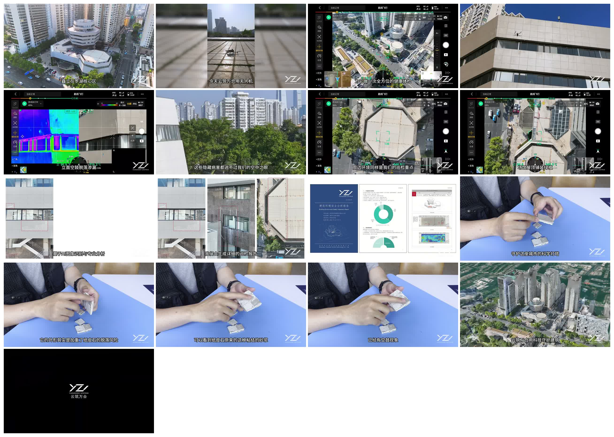
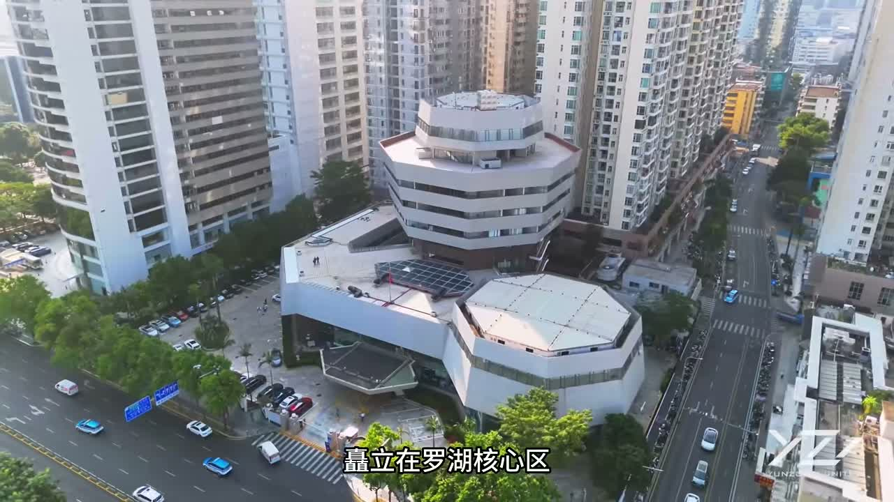
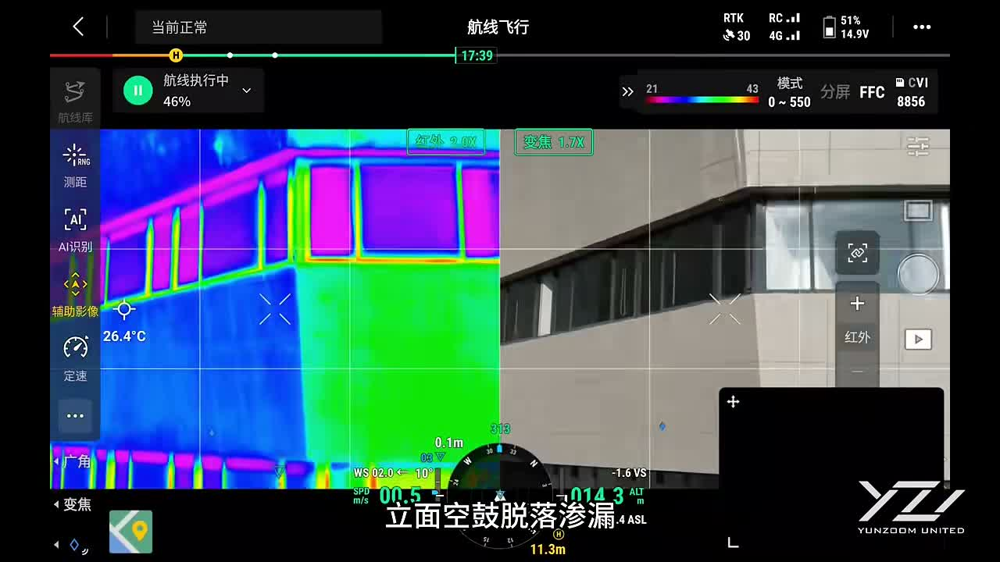
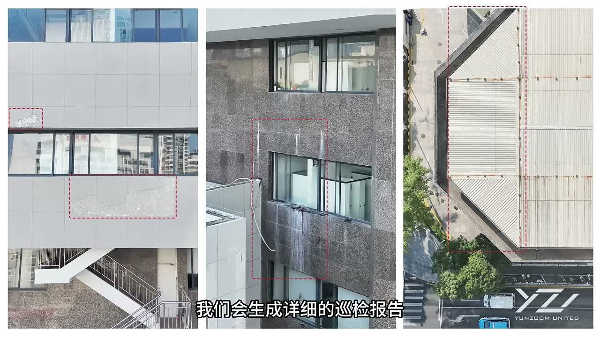
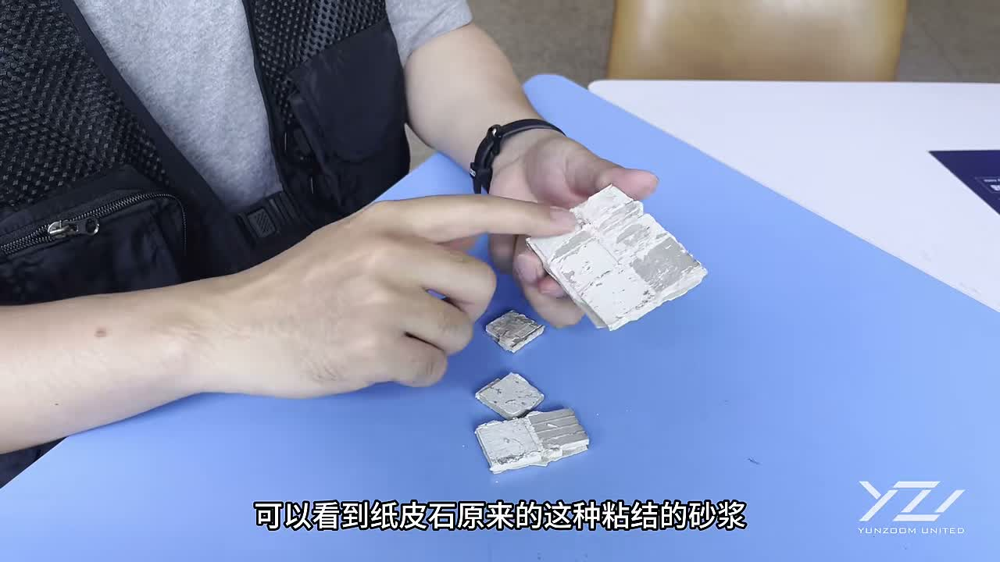

# 云筑万合品牌滚动叙事站策划简报

更新时间：2026-05-06

## 0. 方向校准

本项目不是把现有业务视频改成网页，也不是把视频逐帧绑定到滚动上。

目标是做一个接近 Apple 产品页气质的独立品牌站：用强视觉、少量高密度文案、滚动驱动的场景演进，建立云筑万合的品牌感与业务认知。

现有视频只作为业务语境来源，用来帮助我们理解：

- 云筑万合服务什么对象
- 真实业务场景里有哪些动作
- 哪些技术能力值得被视觉化
- 哪些案例和交付物可以作为信任证据

真正的网站视觉、视频、模型、镜头和动画都可以重新用 AIGC 制作，不需要受原片质感限制。

## 1. 主叙事

已选方向：

> 城市地标的隐形守护系统

这个方向比“无人机巡检服务商”更高级，也比单纯“建筑健康体检”更适合品牌站首页。

建议叙事关系：

- 品牌上层：城市地标的隐形守护系统
- 业务落地：建筑健康体检
- 技术路径：无人机巡检、AI 识别、热成像、专业工程分析
- 交付结果：风险定位、问题解释、巡检报告、维护决策依据

一句话定位：

> 云筑万合以无人机、AI 识别、热成像与工程分析能力，为城市建筑建立更早一步的健康感知系统。

更品牌化的表达：

> 让城市里看不见的建筑风险，提前被感知、被理解、被处理。

## 2. 从视频中提取到的业务要点

视频基础信息：

- 时长：68.33 秒
- 画幅：1280 x 720
- 内容：深圳科学馆相关建筑巡检案例
- 核心场景：航拍定位、无人机作业、热成像、AI 识别、病害标注、报告生成、材料解释

视频体现出的业务闭环：

```text
目标建筑定位
-> 无人机现场巡检
-> 可见光 / 热成像采集
-> AI 图像识别
-> 专业工程判断
-> 风险点标注
-> 巡检报告交付
-> 帮助建筑长期安全运营
```

可以被网站吸收的关键词：

- 建筑健康
- 城市地标
- 外立面安全
- 隐蔽病害
- 空鼓
- 脱落
- 渗漏
- 热异常
- 屋顶风险
- 无人机巡检
- AI 图像识别
- 热成像检测
- 专业报告
- 长期运营安全

## 3. 参考截图

整体联系图：



开场航拍：用于理解“城市地标 / 建筑群 / 真实场景”的空间语境。



热成像界面：可提炼为网站中的扫描、显影、风险高亮、仪表层 UI。



报告画面：可转译为“把现场转化为决策依据”的章节。



材料演示：可用于说明云筑万合不只是采集影像，也能解释问题成因。



## 4. Landing Page 建议结构

### 4.1 Hero

目的：第一屏建立品牌高度，而不是马上解释功能。

主标题建议：

```text
云筑万合
```

副标题候选：

```text
城市地标的隐形守护系统
```

```text
为建筑建立更早一步的健康感知
```

画面方向：

- AIGC 制作一座干净、现代、可信的城市公共建筑或地标建筑
- 镜头极慢推进，建筑立面有克制的扫描光
- 建筑局部在滚动时从真实外观过渡到半透明结构层
- 页面底部露出下一章节的一小部分，给滚动叙事留钩子

动效方向：

- 首屏静止时：镜头轻微漂移，扫描光循环
- 滚动时：镜头推进，建筑被系统“唤醒”

### 4.2 The Invisible Risk

目的：把“隐形风险”讲成用户能感受到的问题。

核心表达：

```text
真正的建筑风险，往往不在显眼处。
```

画面方向：

- 外立面材质逐渐显影
- 空鼓、脱落、渗漏、热异常等风险点逐一浮现
- 不用传统图标卡片，用建筑表面的真实位置承载信息

动效方向：

- 滚动触发局部高亮
- 风险标注框随建筑透视轻微漂移
- 停止滚动时，标注点维持轻循环脉冲

### 4.3 From Flight To Insight

目的：无人机不是噱头，而是感知系统入口。

核心表达：

```text
从一次飞行，到一套可判断的建筑数据。
```

画面方向：

- AIGC / 3D 无人机绕建筑执行航线
- 路径线、采集点、航线网格逐步出现
- 可见光、热成像、局部细节以图层方式叠加

动效方向：

- ScrollTrigger pin 住章节
- 滚动推进 drone 路径
- 场景内 UI 层依次进入
- 停止滚动时，drone 或扫描线局部循环

### 4.4 Intelligence Layer

目的：讲 AI 识别与专业分析，不做功能堆砌。

核心表达：

```text
影像被识别，问题被定位，风险被解释。
```

画面方向：

- 一张建筑外立面影像被系统读取
- AI 框选出风险点
- 影像数据转化成问题类型、位置、风险等级
- 最后叠加“人工复核 / 工程判断”的可信层

动效方向：

- 图像从真实画面变成数据化图层
- 标注框不是同时出现，而是像系统分析一样逐步确认
- 少量数字与标签出现后收束，不做满屏 dashboard

### 4.5 Report As Decision

目的：把“报告”提升为“决策依据”。

核心表达：

```text
不是一组照片，而是一份可行动的建筑健康证据。
```

画面方向：

- 航拍图、热成像、病害标注、位置说明、结论摘要逐步汇入报告
- 报告界面应该高级、干净，有工程文档感
- 可以模拟一份“建筑环境安全分析报告”

动效方向：

- 信息流从多个检测图层收束成报告
- 页面翻页 / 文档聚合 / 标注对齐
- 最后形成完整交付物

### 4.6 Flagship Case

目的：把深圳科学馆作为真实案例锚点。

建议标题：

```text
深圳科学馆建筑健康巡检
```

表达重点：

- 城市核心区建筑
- 外立面与屋顶巡检
- 空鼓、脱落、渗漏等隐患识别
- AI 图像识别与专业分析结合
- 生成详细巡检报告

视觉方向：

- 不做普通案例卡片
- 做成一个旗舰案例故事板
- 用“建筑定位 -> 巡检路径 -> 风险发现 -> 报告交付”四幕展开

### 4.7 Studio / CTA

目的：从宏大叙事回到合作入口。

结尾文案候选：

```text
让每一座地标，都被更早一步守护。
```

```text
为你的建筑，建立一套可持续的健康感知系统。
```

CTA 候选：

- 预约建筑健康体检
- 查看巡检方案
- 联系云筑万合

## 5. AIGC 资产规划

网站可以重新制作下列资产，不必直接使用原视频素材。

### 5.1 Hero 主视觉

类型：

- AIGC 视频
- 3D 建筑模型
- WebGL / Three.js 场景

要求：

- 真实建筑摄影质感
- 干净、明亮、有公共建筑 / 城市地标气质
- 不要赛博朋克，不要过度霓虹
- 建筑应该可被扫描、剖层、标注

### 5.2 建筑剖层与风险显影

类型：

- AIGC 视频序列
- 3D 材质分层
- CSS / Canvas / WebGL 标注层

要表现：

- 外立面空鼓
- 饰面脱落
- 渗漏痕迹
- 热异常区域
- 屋顶排水或结构隐患

### 5.3 无人机巡检镜头

类型：

- AIGC 视频
- 3D drone 模型
- GSAP 路径动画

要表现：

- 绕建筑航线
- 定点采集
- 扫描光束
- 数据回传

### 5.4 报告与数据界面

类型：

- 设计稿转前端
- AIGC 辅助生成报告页视觉
- HTML/CSS/GSAP 图层动效

要求：

- 工程可信
- 干净、克制、信息有层级
- 避免廉价 dashboard 感

## 6. 视觉系统建议

整体气质：

- 高端品牌站
- 科技纪实
- 建筑专业
- 冷静、可信、有责任感

不建议：

- 通用 SaaS 卡片首页
- 传统工程公司红黑金风格
- 过度赛博蓝紫
- 满屏 UI 仪表盘
- 过多功能点堆砌

建议色彩：

```text
雾白       #F3F6FA
建筑灰     #D8E0E8
深钢蓝     #213246
品牌蓝     #2E5C97
巡检绿     #60D2BE
风险高亮   #B7F05E
热异常点缀 #D85FE8
```

使用原则：

- 大面积用雾白、建筑灰、真实建筑影像
- 深钢蓝用于导航、关键文字、报告界面
- 巡检绿用于扫描线、确认状态、路径点
- 热异常色只用于风险显影，不作为主视觉底色

## 7. GSAP 交互模型

推荐做法：

- 用 `ScrollTrigger` 做章节 pinning 和进度驱动
- 每个章节是一段独立 timeline
- 滚动推进主 timeline
- 用户停止滚动后，当前章节进入轻循环 idle animation
- 移动端降级为短视频 / 静态关键帧 / 简化标注动画

不要把整支 68 秒视频作为唯一动画源。

更合理的结构：

```text
短循环视频 / AIGC 视频
+ 透明 PNG / WebP 图层
+ 3D 模型或伪 3D 建筑层
+ GSAP 标注、遮罩、路径、数字、报告聚合
```

交互原则：

- 滚动时有“导演感”，每一屏只推进一个明确叙事动作
- 停止滚动时有生命感，但不能抢用户注意力
- 文案少而准，动画承载主要解释
- 标注和数据层要服务理解，不为了炫技而出现

## 8. 首页文案草稿

Hero：

```text
云筑万合
城市地标的隐形守护系统
```

支撑文案：

```text
以无人机、AI 识别、热成像与工程分析能力，为建筑建立更早一步的健康感知。
```

隐形风险章节：

```text
真正的风险，往往藏在肉眼看不见的地方。
```

巡检章节：

```text
一次飞行，读取建筑表面的细微信号。
```

智能分析章节：

```text
让影像成为判断，让隐患拥有位置、类型与依据。
```

报告章节：

```text
把现场转化为可行动的建筑健康证据。
```

收束：

```text
让每一座地标，都被更早一步守护。
```

## 9. 下一轮需要继续讨论的问题

建议下一轮优先确认：

1. 首屏到底是“真实建筑摄影感”还是“更抽象的未来建筑系统感”
2. 是否保留“深圳科学馆”作为首页旗舰案例
3. 品牌语是否固定为“城市地标的隐形守护系统”
4. 首页是做一页滚动叙事，还是同时规划业务页 / 案例页 / 关于页
5. 资产制作路线偏 AIGC 视频，还是偏 Three.js / WebGL 可交互场景

我目前的倾向：

- 首屏用真实建筑摄影感，避免太虚
- 首页以一页滚动叙事为主
- 深圳科学馆作为旗舰案例，但放在中后段
- 动画用 AIGC 视频作为质感底座，GSAP 负责叙事节奏和信息层
- 后续再拆出业务页与案例页，首页先把品牌高度打起来
